

# 🎯 DevHub — HackTheBox Penetration Test

**Target:** DevHub (HackTheBox) · Linux/Ubuntu · Black-box · Unauthenticated RCE → root

---

## Summary

DevHub exposes a web app (`devhub.htb`) and a developer tool, **MCPJam Inspector**, on port 6274. Full compromise was achieved through an unauthenticated RCE in MCPJam Inspector, followed by discovery of hardcoded credentials that unlocked a root-owned internal service — which handed back root's own SSH key.

| | |
|---|---|
| **Findings** | 10 total — 3 Critical, 1 High, 1 Medium, 4 Low, 1 Info |
| **Key vulnerability** | Unauthenticated RCE in MCPJam Inspector 1.4.2 — `CVE-2026-23744` |
| **Tools used** | Nmap, WhatWeb, ffuf, OWASP ZAP, linpeas.sh, chisel |

---

## Attack Chain

**1. Recon** — Nmap scan identified three exposed services:

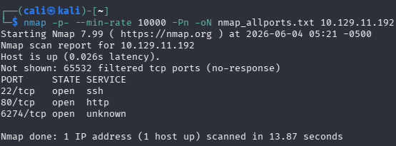

- `22/tcp` — OpenSSH
- `80/tcp` — nginx 1.18.0 → redirects to `devhub.htb`
- `6274/tcp` — MCPJam Inspector web app

**2. Enumeration** — The main site describes its own internal architecture in plain text (an info-disclosure finding in itself), and MCPJam Inspector's interface was reachable directly:

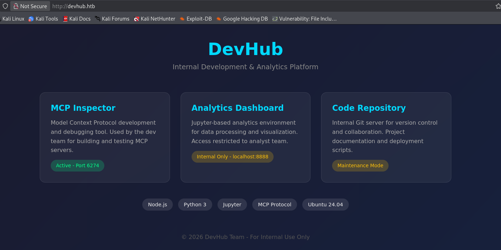
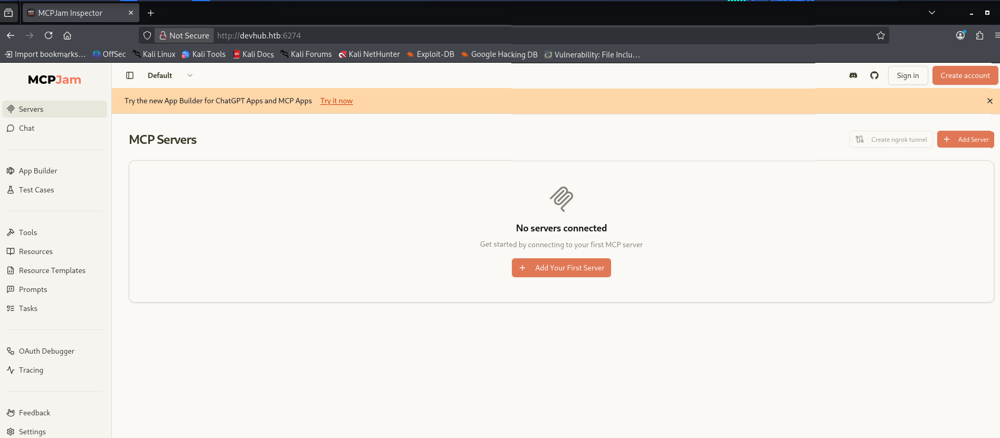

Directory/parameter fuzzing (`ffuf`) and fingerprinting (`whatweb`) turned up nothing further of note.

**3. Automated scan (OWASP ZAP)** — active + passive scan against both `devhub.htb` and the Inspector on `:6274`. No High/Critical alerts, but 10 informational/low alerts were raised — each verified manually to rule out false positives:

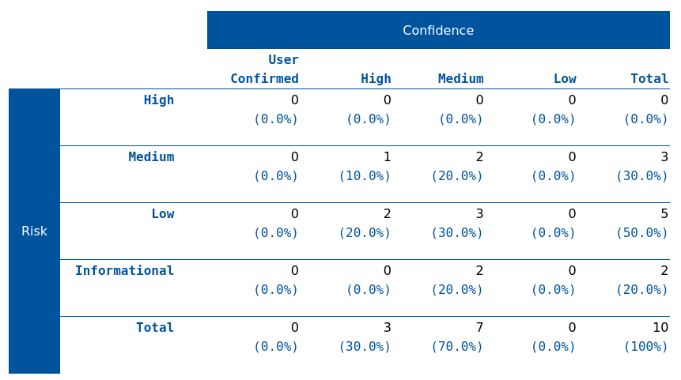

6 of 10 confirmed as real (missing security headers, nginx version disclosure, overly permissive CORS); 2 were false positives (error-message disclosures that turned out to be generic app errors, not real leaks); 2 were out of scope.

**4. Initial access — CVE-2026-23744** — MCPJam Inspector 1.4.2 listens on `0.0.0.0` with **no authentication**. Its `POST /api/mcp/connect` endpoint accepts a JSON body with `command` and `args` fields that are passed straight through to a spawned MCP server process — arbitrary command execution, unauthenticated:

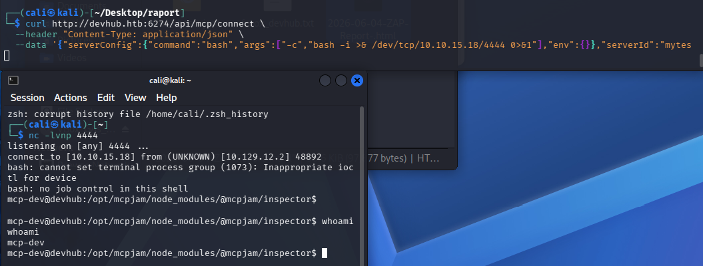

Sent a crafted request → reverse shell as the `mcp-dev` service user.

**5. System enumeration** — checked `/etc/passwd`, kernel/OS version, listening ports (`ss -tlnp`), and the SUID/SGID attack surface:

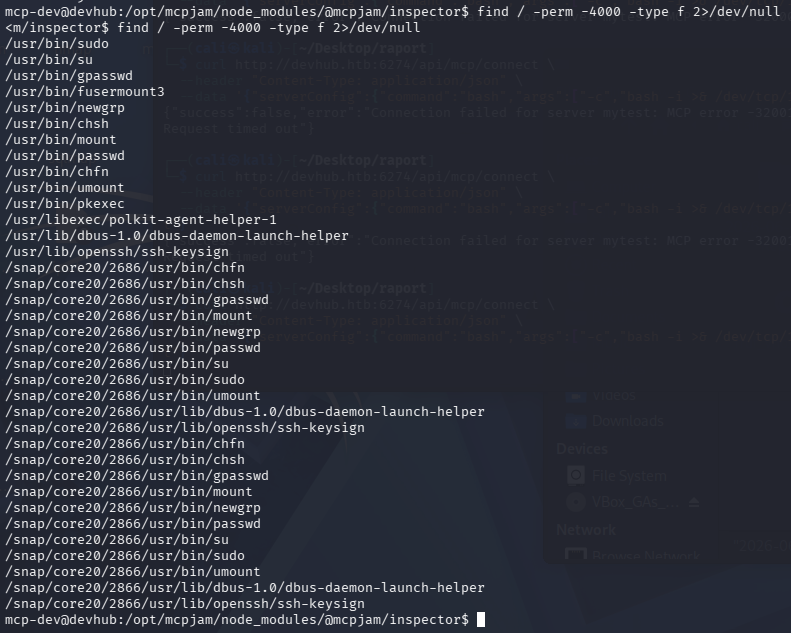

Ran **linpeas.sh** for a broader sweep, which flagged two locally-running services worth investigating further: a JupyterLab instance (as user `analyst`) and a script running as `root`.

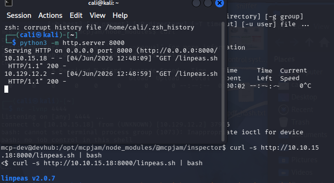

The process list revealed the JupyterLab server was started with its auth token passed directly as a command-line argument — visible to anyone who can list processes:

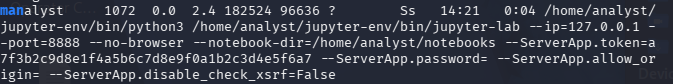

**6. Pivoting to `analyst`** — JupyterLab was bound to `127.0.0.1:8888` only. Pulled down `chisel`, and used it to tunnel that port out to the attacking host:

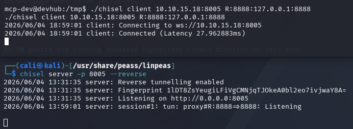

Logged into JupyterLab with the leaked token and opened its built-in terminal — command execution as `analyst`:

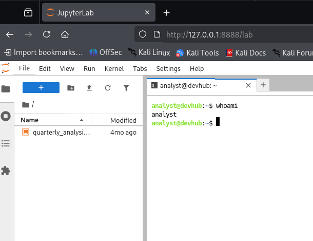

**7. Escalation to root** — from the `analyst` shell, read `/opt/opsmcp/server.py` (a script running as `root`) and found a hardcoded API key alongside plaintext user passwords and tokens:

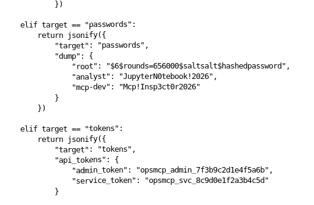

Used the leaked API key against the internal OPSMCP service (which runs as `root`) — it handed back root's own **private SSH key**:

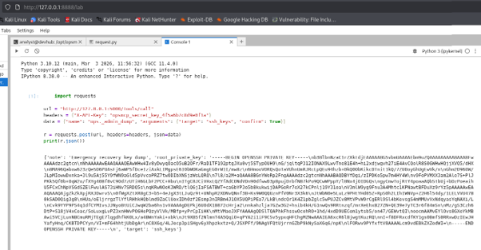

That key was used to SSH in directly as `root`:

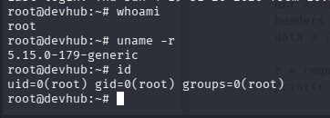

---

## Findings

| ID | Severity | Finding | CVSS |
|---|---|---|---|
| 001 | 🔴 Critical | Unauthenticated RCE in MCPJam Inspector 1.4.2 (`CVE-2026-23744`) | 9.8 |
| 002 | 🔴 Critical | Hardcoded credentials (passwords, API key, tokens) in `/opt/opsmcp/server.py` | 8.8 |
| 003 | 🔴 Critical | Root-owned OPSMCP service leaks root's private SSH key via its API | 9.8 |
| 004 | 🟠 High | JupyterLab session token leaked via process arguments + no password set | 8.0 |
| 005 | 🟡 Medium | No CORS restrictions on the MCP Inspector API (`Access-Control-Allow-Origin: *`) | 5.3 |
| 006 | 🟢 Low | Missing HTTP security headers (CSP, X-Frame-Options, X-Content-Type-Options) | 3.1 |
| 007 | 🟢 Low | nginx version disclosed in `Server` header and error pages | 3.1 |
| 008 | 🟢 Low | Internal architecture disclosed on the public homepage | 3.7 |
| 009 | 🟢 Low | No egress filtering; tools freely downloaded/executed from `/tmp` | 3.5 |
| 010 | ⚪ Info | Service versions disclosed via banners (OpenSSH 8.9p1, MCPJam Inspector 1.4.2) | — |

## Key Recommendations

- Take MCPJam Inspector off the public network entirely, or restrict it to trusted IPs; update to ≥1.4.3 and require authentication.
- Remove all hardcoded secrets from `server.py`; move them to environment variables/a secrets manager and rotate everything that was exposed.
- Never run internal services as `root`; never expose private keys through an API.
- Stop passing auth tokens as process arguments (visible via `ps`); set a real password on JupyterLab.
- Restrict CORS to known origins; add standard security headers; disable `server_tokens`.
